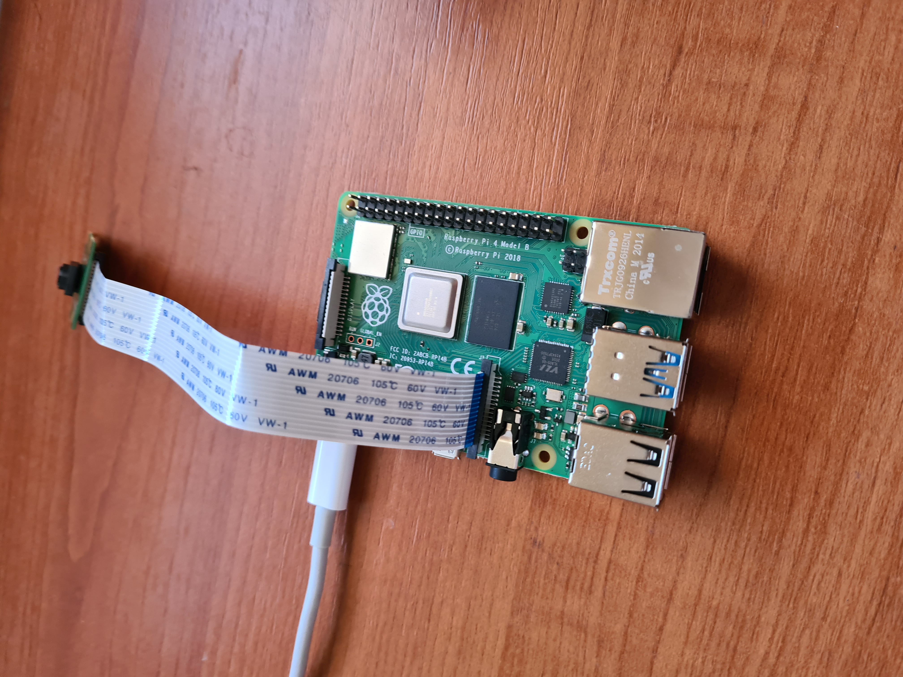

# Custom Object Detection with TensorFlow 2 Lite on Raspberry Pi
This repository continues from my [last project](https://github.com/Purefekt/Custom-Object-Detection-with-TensorFlow-2) where i built a custom object detector for my face using TensorFlow 2. Now i will export that model to TensorFlow 2 Lite so that i can run it on a raspberry pi 4.  
I had saved an unexported copy of my trained model which i will use to export to TensorFlow Lite.  
I will use the same Tensorflow folder which i had created in the last project, it contains all the important scripts.

<p align="left">
  
</p>

## Exporting the model
Open the Anaconda terminal and activate the virtual environment
```
conda activate tensorflow
```
Changing directories
```
cd C:\TensorFlow\workspace\training_demo
```
Use the following command to export the model.
```
python export_tflite_graph_tf2.py --pipeline_config_path models\my_ssd_mobilenet_v2_fpnlite\pipeline.config --trained_checkpoint_dir models\my_ssd_mobilenet_v2_fpnlite --output_directory exported-models\my_tflite_model
```

## Creating a New Environment and Installing TensorFlow Nightly
To avoid version conflicts, i created a new Anaconda virtual environment to hold all the packages necessary for conversion. First, i will deactivate the current environment with
```
conda deactivate
```
This command will create a new environment for TFLite conversion.
```
conda create -n tflite pip python=3.7
```
Using this command we can see all virtual environments.
```
conda info --envs
```
To activate the TFLite environment
```
conda activate tflite
```
**Note: This virtual environment must be activated everytime the anaconda terminal is closed**  
Now i will install TensorFlow in this virtual environment. However, in this environment i will not just be installing standard TensorFlow. i will be installing tf-nightly. This package is a nightly updated build of TensorFlow. This means it contains the very latest features that TensorFlow has to offer. I will be installing the CPU version. To start the installation.
```
pip install tf-nightly
```
Sanity check to test the installation.
```
python
```
```
>>> import tensorflow as tf
>>> print(tf.__version__)
```
Correct installation gives the following output.
```
2.5.0-dev20210203
```

## Converting the model to TensorFlow Lite
Cd into the training_demo directory.
```
cd C:\TensorFlow\workspace\training_demo
```
The following command converts the model to TensorFlow Lite.
```
python convert-to-tflite.py
```
File called ```model.tflite``` should appear in the directory ```exported-models\my_tflite_model\saved_model```

<p align="left">
  
</p>

## Preparing the Model for use
Creating a new labelmap for the model. The old labelmap looked like this
```
item {
    id: 1
    name: 'Veer'
}
```
The new labelmap for TFLite should look like this, with all the classes (1 in my case) written one after the other in new lines. It should be saved in a .txt file format.
```
Veer
```
Save this file in the ```exported-models\my_tflite_model\saved_model``` as ```labels.txt```. The folder will look like this now.

<p align="left">
  
</p>

## Setting up Raspberry Pi and Pi Cam
Use this [repository](https://github.com/Purefekt/Setting-up-Raspberry-Pi-and-Pi-Cam)

## Organizing the Workspace and Virtual Environment
Clone this repository
```
git clone https://github.com/Purefekt/Custom-Object-Detection-with-TensorFlow-2-Lite-on-Raspberry-Pi.git
```
Trimming the name
```
mv Custom-Object-Detection-with-TensorFlow-2-Lite-on-Raspberry-Pi tensorflow
```
Creating a Virtual Environment to avoid conflicts with other installed packages on the Raspberry Pi. To install the virtual environment
```
sudo pip3 install virtualenv
```
Now to create the tensorflow virtual env
```
python3 -m venv tensorflow
```
cd into the directory
```
cd tensorflow
```
Now to activate the virtual environment
```
source bin/activate
```
This virtual environment needs to be activated everytime a new terminal is opened.

## Copying the model.tflite and labels.txt file to the Pi
I created the ```model.tflite``` and ```labels.txt``` files, now i will copy them to the raspberry pi inside the ```tensorflow/models``` folder on the pi. 

<p align="left">
  
</p>

## Installing the Prerequisites onto the Raspberry pi
```
bash install-prerequisites.sh
```
Output should be:
```
Prerequisites Installed Successfully
```
Testing if the installation of tflite_runtime module was correct
```
python
```
```
>>> import tflite_runtime as tf
>>> print(tf.__version__)
```
Correct installation output:
```
2.5.0
```
## Running Object Detection on Image, Video, or Pi Camera
The following scrips can be used to detect the object (my face) in different ways
- ```TFLite-PiCamera-od.py```: This program uses the Pi Camera to perform object detection. It also counts and displays the number of objects detected in the frame. The usage is
```
usage: TFLite-PiCamera-od.py [-h] [--model MODEL] [--labels LABELS]
                             [--threshold THRESHOLD] [--resolution RESOLUTION]

optional arguments:
  -h, --help            show this help message and exit
  --model MODEL         Provide the path to the TFLite file, default is
                        models/model.tflite
  --labels LABELS       Provide the path to the Labels, default is
                        models/labels.txt
  --threshold THRESHOLD
                        Minimum confidence threshold for displaying detected
                        objects
  --resolution RESOLUTION
                        Desired webcam resolution in WxH. If the webcam does
                        not support the resolution entered, errors may occur.
```
- ```TFLite-Image-od.py```: This program takes a single image as input. The usage is
```
usage: TFLite-Image-od.py [-h] [--model MODEL] [--labels LABELS]
                          [--image IMAGE] [--threshold THRESHOLD]
                          [--resolution RESOLUTION]

optional arguments:
  -h, --help            show this help message and exit
  --model MODEL         Provide the path to the TFLite file, default is
                        models/model.tflite
  --labels LABELS       Provide the path to the Labels, default is
                        models/labels.txt
  --image IMAGE         Name of the single image to perform detection on
  --threshold THRESHOLD
                        Minimum confidence threshold for displaying detected
                        objects
  --resolution RESOLUTION
                        Desired webcam resolution in WxH. If the webcam does
                        not support the resolution entered, errors may occur.
```
- ```TFLite-Video-od.py```: This program is similar to the last two however it takes a video as input. The usage is
```
usage: TFLite-Video-od.py [-h] [--model MODEL] [--labels LABELS]
                          [--video VIDEO] [--threshold THRESHOLD]
                          [--resolution RESOLUTION]

optional arguments:
  -h, --help            show this help message and exit
  --model MODEL         Provide the path to the TFLite file, default is
                        models/model.tflite
  --labels LABELS       Provide the path to the Labels, default is
                        models/labels.txt
  --video VIDEO         Name of the video to perform detection on
  --threshold THRESHOLD
                        Minimum confidence threshold for displaying detected
                        objects
  --resolution RESOLUTION
                        Desired webcam resolution in WxH. If the webcam does
                        not support the resolution entered, errors may occur.
```
To test it:
```
python TFLite-PiCamera-od.py
```
The Object detection is working correctly with 0.5fps on the Raspberry Pi.

<p align="left">
  
</p>
